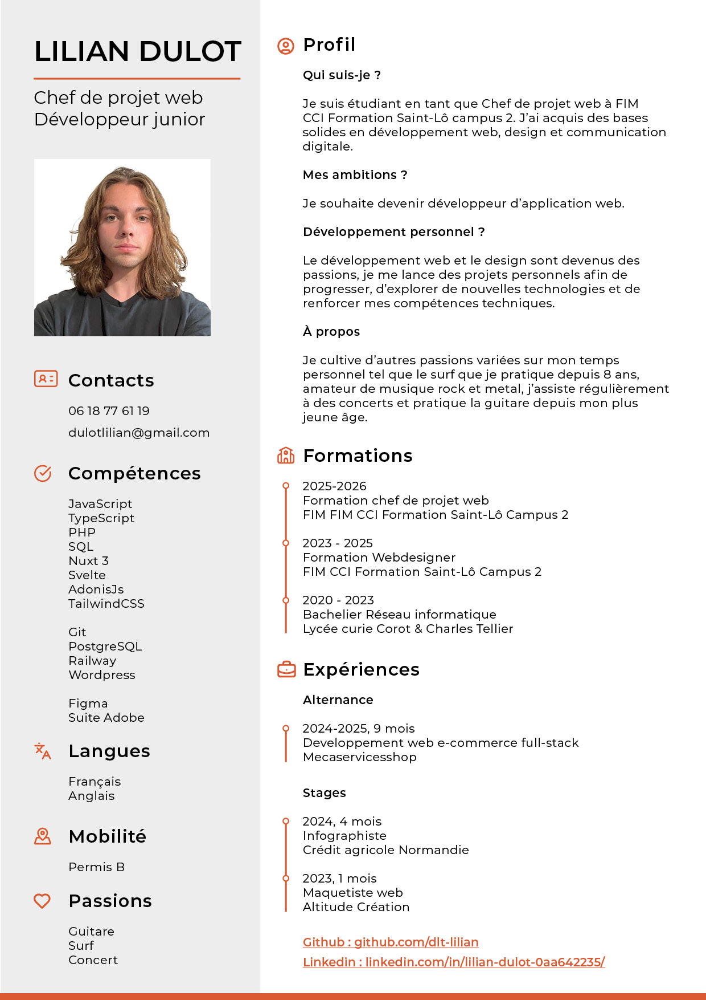

## Hey ! 👋 Je suis Lilian

**Développeur Junior** • **19 ans** • **France** 🇫🇷

---

## 🚀 À propos de moi

Le développement web est devenu une passion, je me lance des projets personnels afin de progresser, d’explorer de nouvelles technologies et de renforcer mes compétences techniques.

```javascript
const lilian = {
    age: 19,
    status: "Junior Developer",
    passion: ["Coding", "Learning", "Music", "Guitar", "Surf"],
    nextGoal: "Work With you"
};
```

---

## 🛠️ Technologies que j'explore
###  Languages :


###  Frameworks :


###  Outils & autres :


---

## 📈 Mes objectifs

- 🎯 Décrocher une alternance
- 📚 Perfectionner mes compétences & continuer à apprendre de nouvelles technologies

---

## 📫 On se connecte ?

- 📧 Email : [dulotlilian@gmail.com](mailto:dulotlilian@gmail.com)
- 💼 Linkedin : https://www.linkedin.com/in/lilian-dulot-0aa642235/
- 🌐 Portfolio : en cours de développement

---

📊 **Stats GitHub:**


---

## Mon CV


